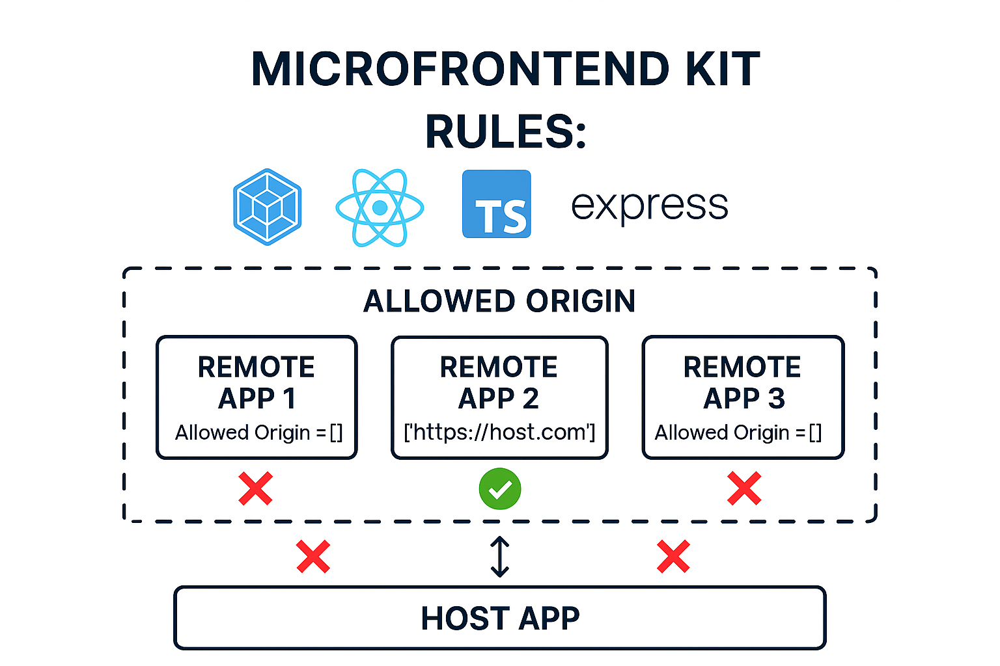

# 🔗 Module Federation Monorepo Webpack Kit

<!-- 

A boilerplate setup for **Module Federation** using **Webpack**, designed for building scalable **micro-frontend** architectures. This kit provides a complete setup for both **host** and **remote** applications to share React components dynamically.

## 🚀 Features

- 🎯 **Webpack 5** with Module Federation: Seamless sharing of code across independent apps.
- ⚛️ **React + TypeScript**: Fully typed setup with React best practices.
- 🔥 **Hot Module Replacement**: Built-in React Fast Refresh for blazing-fast development.
- 🧩 **Multiple Environments**: Easily configure **development**, **staging**, and **production**.
- 🛡️ **Secured Remote Access**: Protects remote modules with custom Express middleware.
- 📦 **Optimized Builds**: Production-ready with tree shaking, minification, and code splitting.

---

## 🛠️ Prerequisites

Make sure you have the following installed:

- [Node.js](https://nodejs.org/) (v20 or higher)

---

## 📦 Installation

1. **Clone the repo**

```bash
git clone https://github.com/your-username/module-federation-webpack-kit.git
cd module-federation-webpack-kit
```

2. **Install dependencies**

```bash
npm install
# or
pnpm install
```

---

## ⚡️ Development

This project includes a **host** and a **remote** application with pre-configured **Module Federation** settings. You can run both to see them working together!

### 🧑‍✈️ Run the Host App

```bash
npm run start:host
# or
pnpm start:host
```

> 🌐 Runs on [http://localhost:3000](http://localhost:3000)

### 🛰️ Run the Remote App

```bash
npm run start:remote
# or
pnpm start:remote
```

> 🌐 Runs on [http://localhost:3001](http://localhost:3001)

---

## 🔐 Securing Remote App Access

The remote app is served using an **Express** server that includes customizable **middleware** for security. This ensures only authorized access to your exposed modules.

🔒 Middleware can be configured to:

- ✅ Allowlist specific hosts
- 🪪 Require auth tokens
- 🌍 Restrict by environment or IP
- 🛑 Block unwanted requests before serving federated modules

Example logic is in `server.js`. Modify it to suit your team’s needs!

---

## 🔧 Webpack Configs

### 📁 `webpack.common.ts`

Shared config used by both host and remote.

### 🧪 `webpack.dev.ts`

Development-only config:

- HMR
- Fast Refresh
- Source maps

### 🏗️ `webpack.prod.ts`

Production config:

- Minification
- Tree shaking
- Module federation

### 🧬 `ModuleFederationPlugin` Usage

**Remote App**

```ts
new ModuleFederationPlugin({
  name: "remoteApp",
  filename: "remoteEntry.js",
  exposes: {
    "./RemoteComponent": "./src/components/RemoteComponent",
  },
  shared: {
    react: { singleton: true, eager: true, requiredVersion: deps.react },
    "react-dom": {
      singleton: true,
      eager: true,
      requiredVersion: deps["react-dom"],
    },
  },
});
```

**Host App**

```ts
const RemoteComponent = React.lazy(() => import("remoteApp/RemoteComponent"));
```

Use it like this:

```tsx
<Suspense fallback={<div>Loading Remote Component...</div>}>
  <RemoteComponent />
</Suspense>
```

---

## 🏗️ Building for Production

### Build the Host

```bash
npm run build:host
# or
pnpm build:host
```

### Build the Remote

```bash
npm run build:remote
# or
pnpm build:remote
```

> Outputs go to the `dist/` directory.

---

## 🌐 Environment Modes

You can build apps for multiple environments (e.g. `development`, `staging`, `production`) using custom `NODE_ENV` values.

Example for staging:

```json
"build:staging": "NODE_ENV=staging webpack --config webpack.config.js --mode production"
```

Staging runs in **production mode** to reflect real behavior but uses separate configs or env variables.

---

## 🧩 How It Works

1. Remote exposes components with `ModuleFederationPlugin`.
2. Host dynamically imports these components with `React.lazy`.
3. At runtime, Webpack loads them from the remote server!

> This makes each app independently deployable while still being integrated.

---

## 🧠 Dev Workflow Tips

1. ✅ Start **host** and **remote** apps.
2. 🛠️ Add new components in the remote and expose them.
3. 🧲 Lazy load new components in the host.
4. 🔒 Use middleware to secure remote in non-dev environments.
5. 🚀 Deploy independently!

---

## 🧪 Example Error Handling

If the remote app fails to load, avoid crashing the app:

```tsx
<Suspense fallback={<div>Loading Remote Component...</div>}>
  <ErrorBoundary fallback={<div>Failed to load remote component.</div>}>
    <RemoteComponent />
  </ErrorBoundary>
</Suspense>
```

> Wrap lazy imports in an error boundary for safety 🚧

---

## 💬 Questions or Feedback?

Feel free to open issues, submit PRs, or just ⭐️ the repo if you like it!

--- -->
